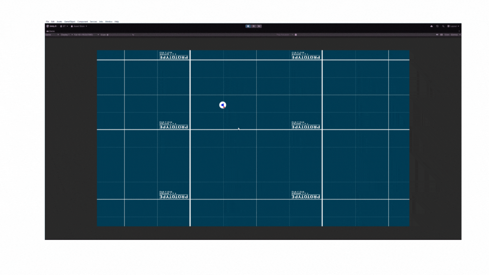

# Takım İsmi
<!-- Takım isminizi buraya yazın. -->
<!-- Örnek: Imagine 4 -->
- Grup 53

<!--# Takım Logosu
<!-- Takım logonuzun bir resmini buraya ekleyin. -->
<!-- Örnek:  -->

# Takım Elemanları

| | İsim Soyisim | Görev | |
| :--- | :--- | :--- | :--- |
| <!-- Profil Fotoğrafı --> | Halit Bakihan Tokgöz | Scrum Master, Product Owner, Developer | <!-- Sosyal Medya Linki --> |
| <!-- Profil Fotoğrafı --> | Mehmet Tunahan Çanak | Developer | <!-- Sosyal Medya Linki --> |

# Oyun İsmi
<!-- Oyunun ismini buraya yazın. -->
<!-- Örnek: The Ghost of Anna -->
- **GRIDFLARE**

<!--# Oyun Logosu
<!-- Oyun logonuzun bir resmini buraya ekleyin. -->
<!-- Örnek:  -->

# Oyun Açıklaması
**GRIDFLARE**, modern **DOOM**'un durmak bilmeyen agresifliğini ve **Souls** oyunlarının ustalık isteyen savunma mekaniklerini **2D piksel bir mermi cehenneminde** birleştiren, adrenalin dolu bir **roguelike** nişancı oyunudur. Bu yukarıdan bakışlı kaosun ortasında sadece mermilerden kaçmaz, savaşın ritmini siz belirlersiniz. **Parry** (Savuşturma), **Blok** ve ölümcül **Riposte** (Karşı Saldırı) yeteneklerinizle en kalabalık düşman dalgalarını bile lehinize çevirin.
Her bir düşman, farklı saldırı ve savunma taktikleri gerektiren, çözülmesi gereken bir bilmece gibidir. Doğru anda doğru silahı ve yeteneği kullanmak, hayatta kalmak ile zafere ulaşmak arasındaki ince çizgidir. Her döngüde, ezici bir kaos ortamını, yeteneklerinizin konuştuğu tatmin edici bir güç gösterisine dönüştürün ve sizi hapseden bu cehennemden çıkmak için savaşın.

<!--## Oyun Hikayesi
<!-- Oyununuzun detaylı hikayesini buraya yazın. -->

# Oyun Özellikleri
<!-- Oyunun temel özelliklerini listeleyin. -->
- 2D Pixel Art
- Tek Oyunculu
- Aksiyon / Roguelike / Twin-Stick Shooter
- Yüksek Tempolu Savaş Bulmacası
- Yüksek Tekrar Oynanabilirlik

# Hedef Kitle
<!-- Oyununuzun hedef kitlesini listeleyin. -->
- Zorlu Aksiyon-Roguelike Oyun Severler (Hades, Dead Cells, Enter the Gungeon gibi oyunların oyuncuları)
- Yüksek Tempolu ve Akıcı Savaş Sistemlerini Sevenler (DOOM Eternal, Ultrakill gibi oyunların oyuncuları)
- Souls-like Türü ve Mekaniklerine Meraklı Oyuncular (Sekiro, Elden Ring vb. oyunlardan keyif alanlar)

# Pazarlama Planı
<!-- Pazarlama ve satış stratejilerinizi buraya listeleyin. -->
- Oyunumuzun, türleri yenilikçi bir şekilde birleştiren mekanikleri ve yüksek tempolu oynanışıyla kendi alanında öne çıkacağına ve büyük bir potansiyel taşıdığına inanıyoruz. Bu potansiyeli değerlendirmek için, oyun içi reklamlar yerine doğrudan bir Steam sayfası oluşturarak oyuncu topluluğumuzla organik bir bağ kurmayı hedefliyoruz.
- Oyun çıktıktan sonra da düzenli güncellemeler, yeni içerikler (silahlar, düşmanlar, boss'lar) ve dengelemelerle oyunu canlı tutarak uzun vadeli bir satış stratejisi izleyeceğiz.
- Oyunumuzun başlangıç fiyatı 10-20$ aralığında planlanmakta.
- İlerleyen süreçte bir DLC ile Co-op desteği getirmeyi planlıyoruz.

# Product Backlog URL
<!-- Product Backlog'unuza ait linki buraya ekleyin. -->
[Product Backlog Board](https://trello.com/b/ksmYSObB/group-53-product-backlog)

---
# Sprint 1

- **Sprint Notları**: User Story'ler ve Task'ler product backlog'ların içine yazılmıştır. Product backlog içinde farklı farklı kategorilere ayrılmış bir şekilde sunulmaktadır. 
 <!-- Sprint notlarınızı buraya yazın. (Örnek: User Story'ler product backlog içine yazılmıştır...) -->

- **Sprint içinde tamamlanması tahmin edilen puan**: 67 puan
 <!-- Tahmini puanı buraya yazın. -->

- **Puan tamamlama mantığı**: Proje boyunca tamamlanması gereken 214 puanlık backlog bulunmaktadır. Backlogların puanları Fibonacci serisi kullanılarak en zor 13 olmak üzere, zorluk derecesi azalacak şekilde sırasıyla; 8 puan, 5 puan, 3 puan, 2 puan ve 1 puandır.
<!-- Puanlama mantığınızı buraya açıklayın. -->

- **Backlog düzeni ve Story seçimleri**: Backlog, temel oynanış mekaniklerini içeren oyun için başlangıç görevi görmesi için yapılmıştır. Ekibimizin sayısı az olduğundan Sprint başına tahmin edilen belirli bir puan sayımız mevcut değildir. Çalışmanın gece gündüz devam edebilmesi için esnek tutulmuştur. Trello Board'da gözüken mavi etiketli kartlar oyuncu mekanikleri, pembe etiketli kartlar sanat ve estetik, mor etiketli kartlar YZ, kırmızı etiketler savaş ve silahlar, gri renkli etiketler motorun işlevselliğini ile ilgili görevleri temsil etmektedir.
 <!-- Backlog düzeninizi ve seçim kriterlerinizi buraya yazın. -->

- **Daily Scrum**: Daily Scrum toplantıları Meets üzerinden gerçekleşmiştir. Daily Scrum toplantılarımız ve günlük Whatsapp konuşmalarımız linklerde mevcuttur.

<strong>Daily Scrum Ekran Görüntüleri (Genişletmek için tıklayın)</strong>

  
  <!-- Bu alana oyunun mevcut durumuna ait ekran görüntülerini ekleyin. -->
  
  
  
  

### Sprint Board
<!-- Sprint board'unuzun ekran görüntüsünü buraya ekleyin. -->

<strong>Ürün Durumu: Ekran Görüntüleri (Genişletmek için tıklayın)</strong>

  
  <!-- Bu alana oyunun mevcut durumuna ait ekran görüntülerini ekleyin. -->
  
  
  
  
  

### Sprint Review
- Oyunun rogue-like tasarlanması sebebi ile silahlar,düşmanlar ve hatta düşman saldırıları dahil her sistemin Scriptable Object kullanılarak Data-Driven şekilde yapılması kararlaştırıldı. Bunun oyunun tekrar oynanabilirliği, procedural generation algoritmaları için elverişli olacağı kararlaştırıldı. Oyunun şu anki halinde herhangi bir sorun bulunmadı.
 <!-- Sprint review toplantısının özetini buraya yazın. -->
- **Sprint Review Katılımcıları**: Halit Bakihan Tokgöz  <!-- Katılımcıların isimlerini buraya yazın. -->

### Sprint Retrospective
- Yalnızca iki grup üyesi bulunduğu için retrospective tam verimde olmadı. Oyunda kullanılacak hangi assetlerin hazır kullanılacağı, hangilerinin elle yapılacağı kararlaştırıldı.
- **Sprint Review Katılımcıları**: Halit Bakihan Tokgöz, Mehmet Tunahan Çanak.

---

---
# Sprint 2

- **Sprint Notları**: User Story'ler ve Task'ler product backlog'ların içine yazılmıştır. Product backlog içinde farklı farklı kategorilere ayrılmış bir şekilde sunulmaktadır. 
 <!-- Sprint notlarınızı buraya yazın. (Örnek: User Story'ler product backlog içine yazılmıştır...) -->

- **Sprint içinde tamamlanması tahmin edilen puan**: 73 puan
 <!-- Tahmini puanı buraya yazın. -->

- **Puan tamamlama mantığı**: Proje boyunca tamamlanması gereken 214 puanlık backlog bulunmaktadır. Backlogların puanları Fibonacci serisi kullanılarak en zor 13 olmak üzere, zorluk derecesi azalacak şekilde sırasıyla; 8 puan, 5 puan, 3 puan, 2 puan ve 1 puandır.
<!-- Puanlama mantığınızı buraya açıklayın. -->

- **Backlog düzeni ve Story seçimleri**: Backlog, ileri seviye oynanış mekaniklerini içeren, özellikle çeşitli düşman saldırıları için tasarımcı dostu bir sistem üretmek için yapılmıştır. Ekibimizin sayısı az olduğundan Sprint başına tahmin edilen belirli bir puan sayımız mevcut değildir. Çalışmanın gece gündüz devam edebilmesi için esnek tutulmuştur. Trello Board'da gözüken mavi etiketli kartlar oyuncu mekanikleri, pembe etiketli kartlar sanat ve estetik, mor etiketli kartlar YZ, kırmızı etiketler savaş ve silahlar, gri renkli etiketler motorun işlevselliğini ile ilgili görevleri temsil etmektedir.
 <!-- Backlog düzeninizi ve seçim kriterlerinizi buraya yazın. -->

- **Daily Scrum**: Daily Scrum toplantıları Meets üzerinden gerçekleşmiştir. Daily Scrum toplantılarımız ve günlük Whatsapp konuşmalarımız linklerde mevcuttur.

<strong>Daily Scrum Ekran Görüntüleri (Genişletmek için tıklayın)</strong>

  
  <!-- Bu alana oyunun mevcut durumuna ait ekran görüntülerini ekleyin. -->
  
  
  

### Sprint Board
<!-- Sprint board'unuzun ekran görüntüsünü buraya ekleyin. -->

<strong>Ürün Durumu: Ekran Görüntüleri (Genişletmek için tıklayın)</strong>

  
  <!-- Bu alana oyunun mevcut durumuna ait ekran görüntülerini ekleyin. -->
  
  
  
  
  

### Sprint Review
- Oyunun rogue-like tasarlanması sebebi ile kararlaştırılan Scriptable Object kullanılarak Data-Driven şekilde düşman,silah ve düşman saldırıları sistemleri yapıldı. Bu sistemler sayesinde editör üzerinden düşman ve saldırı tasarlamaya olanak tanıyor. Oyunun ana karakteri ve bazı düşmanlarının tasarımları ve animasyonları hazırlandı. Oyunun şu anki halinde herhangi bir sorun bulunmadı.
 <!-- Sprint review toplantısının özetini buraya yazın. -->
- **Sprint Review Katılımcıları**: Halit Bakihan Tokgöz, Mehmet Tunahan Çanak  <!-- Katılımcıların isimlerini buraya yazın. -->

### Sprint Retrospective
- İki kişilik mini grubun gidişatının iyi olduğuna üzerinde uzlaşıldı ve oyunun son hali üzerinde tartışıldı.
- **Sprint Review Katılımcıları**: Halit Bakihan Tokgöz, Mehmet Tunahan Çanak.

---
